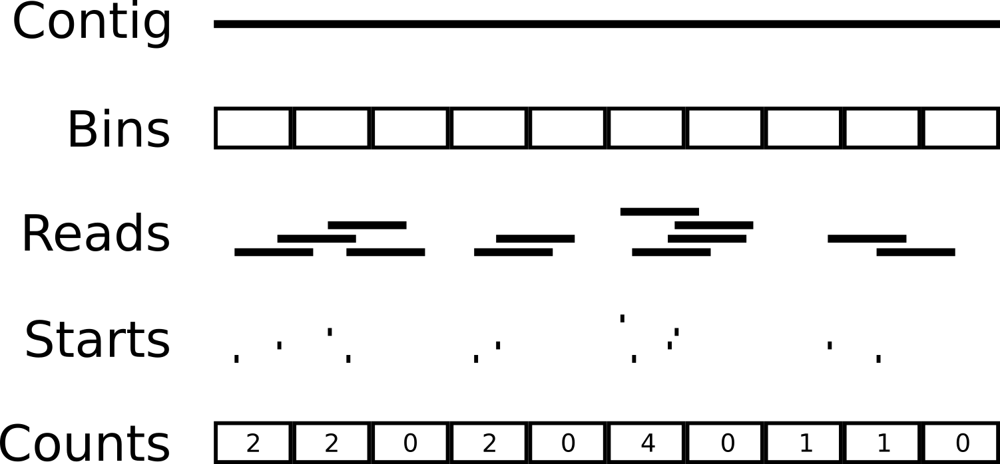

# Summary

Calculating the read-coverage of sequencing reads to a reference genome is a routine task with many applications. Some 
examples include identifying duplication or deletion events in a draft genome assembly, identifying related contigs for 
binning in metagenome assemblies, or analysing taxonomic compositions of metagenome samples. Calculating read-coverage 
information typically involves several read and write operations of the sequencing data. This is not a problem for small
datasets. However, this can be a significant bottleneck when analysing a large number of samples, or when screening very
large reference sequence files. Koverage is designed to reduce the I/O burden as much as possible to enable maximum 
scalability for large sample sizes. It also includes a kmer-based coverage method that significantly reduces the 
computational complexity of screening large reference genomes. Koverage is a Snakemake [@snakemake] based pipeline, 
providing out-of-the-box support for HPC and cloud environments. It utilises the Snaketool [@snaketool] command line 
interface and is available to install via PIP or Conda for maximum ease-of-use. The source code and documentation is 
available at [https://github.com/beardymcjohnface/Koverage](https://github.com/beardymcjohnface/Koverage).

# Statement of need

With the current state of sequencing technologies, it is trivial to generate terabytes of sequencing data for
hundreds or even thousands of samples. Furthermore, databases such as the Sequence Read Archive (SRA) and the European
Nucleotide Archive (ENV), containing nearly 100 petabytes combined of sequencing data, are constantly being mined and
reanalysed in bioinformatics analyses. Computational inefficiencies at such scales waste thousands of dollars worth of 
service units, while memory and I/O bottlenecks can lead to under-utilisation of CPUs. In more severe cases, I/O heavy 
processes in large parallel batches can result in significantly impaired performance, especially for HPC clusters with a
shared scratch space of spinning disk hard drives.

While there are tools for performing coverage calculations, they are not optimised for deployment at large scales, or 
when analysing large reference files. A typical approach may require several complete read and write operations of the 
sequencing data in order to generate the coverage statistics. Furthermore, mapping to very large reference sequence 
files can require large amounts of memory, or alternatively, aligning reads in chunks and coalescing these chunked
alignments at the end, resulting in even more I/O operations. Some solutions involve moving I/O operations into memory,
for instance via tempfs. However, whether this is a feasable option is highly system-dependent and will nevertheless
exacerbate any existing memory bottlenecks.

Koverage addresses the I/O bottleneck of large datasets by eliminating the sorting, reading, and writing of intermediate
alignment files. Koverage also includes a kmer-based implementation to eliminate memory bottlenecks that may arise from
screening large reference files. 

# Implementation

Koverage is written in Snakemake [@snakemake] and Python, and uses the Snaketool [@snaketool] command line interface 
(CLI). The Snaketool CLI will take the user input command line arguments and Koverage's default configuration to 
build a runtime config file. It will then build the Snakemake command and run the pipeline. Any unrecognised command 
line arguments are assumed to be Snakemake args and are added to the Snakemake command. For cluster or cloud execution, 
users are encouraged to generate a Snakemake profile for their chosen deployment, and Koverage has been designed to be 
compatible with Snakemake's Cookiecutter [@cookiecutter] template profiles. The only required inputs are the reference 
FASTA-format file (\-\-ref), and the sample reads (\-\-reads).

# Sample parsing

Koverage will parse sample reads (\-\-reads) using MetaSnek fastq_finder [@metasnek]. Users supply either a directory 
containing their sequencing reads, or a tab-separated values (TSV) file listing their sample names and corresponding 
sequencing read filepaths. If users supply a directory to \-\-reads, sample names and read file pairs will be inferred 
from the file names. If users supply a TSV file, sample names and filepaths will simply be read from the file. More 
information and examples are available at [https://gist.github.com/beardymcjohnface/bb161ba04ae1042299f48a4849e917c8](https://gist.github.com/beardymcjohnface/bb161ba04ae1042299f48a4849e917c8)

# Mapping-based coverage

This is the default method for calculating coverage statistics. Reads are mapped sample-by-sample to the reference 
genome using Minimap2 [@minimap]. The minimap2 alignments are parsed in real-time by a wrapper script that collects the
counts per contig and total counts per sample. Koverage also uses the read mapping coordinates to collect read counts 
for 'windows' or 'bins' along the contig. This allows for a fast approximation of the coverage of each contig by at 
least one read (hitrate), and of the evenness of coverage (variance) for each contig. Following mapping, the final 
counts, mean, median, hitrate, and variance are written to a TSV file. A second script calculates the Reads Per Million
(RPM), Reads Per Kilobase Million (RPKM), Reads Per Kilobase (RPK), and Transcripts Per Million (TPM) like so:

__RPM__ = $\frac{10^6 \times N}{T}$

__RPKM__ = $\frac{ 10^6 \times N}{T \times L}$

__RPK__ = $\frac{N}{L}$

__TPM__ = $\frac{10^6 \times RPK}{R}$

Where:

 - N = number of reads mapped to the contig
 - T = Total number of mapped reads for that sample
 - L = length of contig in kilobases
 - R = sum of all RPK values for that sample

Koverage also generates a fast estimation for hitrate, which represents the fraction of the contig covered by at least 
one read, and the variance of coverage across the contig. It estimates these values by first collecting the counts of the 
start coordinates of mapped reads within _bins_ (or _windows_) across each contig (Figure 1). The variance is calculated 
directly as the standard variance of these counts. The hitrate is calculated as the number of bins greater than zero 
divided by the total number of bins.

> 
> 
> __Figure 1: Windowed-coverage counts__. Counts of start coordinates of mapped reads are collected for each _bin_ 
> across a contig. The counts array is used to calculate estimates for coverage hitrate and variance.

Lastly, the coverage from all samples are collated, and a summary of the coverage for each contig by all samples is 
calculated. A summary HTML report is then generated which includes interactive graphs and tables for both the per sample
coverge, and the combined coverage from all samples.

# Kmer-based coverage

As mentioned above, mapping to very large reference genomes can place considerable strain on computer resources. As an
alternative, Koverage offers a kmer-based approach to estimating coverage across contigs. First, the reference genome is
processed and kmers are sampled evenly across each contig. The user can customise the kmer size, sampling interval, and 
minimum and maximum number of kmers to sample for each contig. Jellyfish [@jellyfish] databases are then created for 
each sample. Koverage will initiate an interactive Jellyfish session for each sample's kmer database. The kmers that 
were sampled from each reference contig are queried against the sample kmer database and the kmer counts, and a kmer 
count array is created for each contig. The sum, mean, and median are calculated directly from the count array, and the 
hitrate is calculated as the number of kmer counts > 0 divided by the total number of kmers queried. As variance is 
highly sensitive to large outliers, and kmer counts are especially prone to large outliers for repetitive sequences, the 
variance is calculated as the standard variance of the lowest 95 % of kmer counts.

# CoverM wrapper

Koverage includes a wrapper for the popular CoverM [@coverm] tool. CoverM can parse aligned and sorted reads in BAM 
format. However, it can also align reads with minimap2, saving the sorted alignments in a temporary filesystem (tempfs), 
and then process the aligned and sorted reads from tempfs. When a large enough tempfs is available, this method of 
running CoverM is extremely fast. However, if the tempfs is insufficient for storing the alignments, they are instead 
written to and read from regular disk storage which can be a significant I/O bottleneck. This wrapper in Koverage will 
use Minimap2 to generate alignments, sort them and save them in BAM format with SamTools [@samtools], and then run
CoverM on the resulting BAM file. While this is not the fastest method for running CoverM, it is convenient for users
wishing to retain the sorted alignments in BAM format, and for automated running over many samples with a combined 
output summary file.

# Benchmarks

We tested Koverage's methods on a Coral metagenome dataset [@coral] and a Chardonnay WGS dataset [@chardonnay] using the 
Pawsey Supercomputing Research Centre's Setonix HPC (commissioned in 2023) [@setonix]. We also tested the methods on a 
database of 1 million prophages [@prophage, @prophageLaura] against one sample from the Coral dataset using Flinders 
University's HPC [@deepthought] to benchmark coverage using a large reference file. We also tested the kmer-based method 
with our prophage database against a subset of the Human Microbiome Project WGS metagenome database [@hmpdacc] to 
examine its scalability for screening large references files against large sequencing datasets. 

> __Table 1: Mapping-based coverage benchmarks__
> 
> Dataset | Reference size | Reads size | CPU Walltime | Peak memory
> --- | --- | --- | --- | ---
> [@coral] | 360 Mbp | 9.1 GB | - 
> [@chardonnay] | 490 Mbp | 1.6 TB | - 
> [@prophage] | 31.2 Gbp | 438 MB | - 

> __Table 2: Kmer-based coverage benchmarks__
> 
> Dataset | Reference size | Reads size | CPU Walltime | Peak memory 
> --- | --- | --- | --- | --- 
> [@coral] | 360 Mbp | 9.1 GB | 37m16s | 4.16 GB 
> [@chardonnay] | 490 Mbp | 1.6 TB | 14h50m | 53.52 GB
> [@prophage] | 31.2 Gbp | 438 MB | 42m33s | 4.5 GB
> [@prophage,@hmpdacc] | 31.2 Gbp | 903 GB | - 

> __Table 3: CoverM wrapper benchmarks__
> 
> Dataset | Reference size | Reads size | CPU Walltime | Peak memory 
> --- | --- | --- | --- | --- 
> [@coral] | 360 Mbp | 9.1 GB | 16m55s | 4.89 GB
> [@chardonnay] | 490 Mbp | 1.6 TB | 12h04m   | 10.31 GB
> [@prophage] | 31.2 Gbp | 438 MB | - | -

# Acknowledgments

This work was supported by resources provided by the Pawsey Supercomputing Research Centre with funding from the 
Australian Government and the Government of Western Australia. The support provided by Flinders University for HPC 
research resources is acknowledged. This work was supported by an award from NIH NIDDK RC2DK116713 and an award from the 
Australian Research Council DP220102915. 

# References
